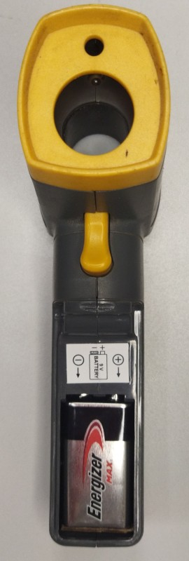
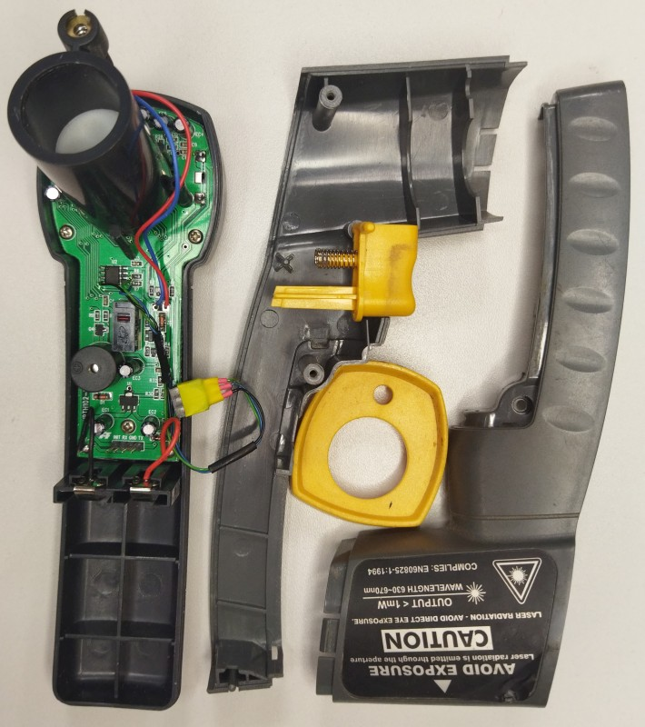
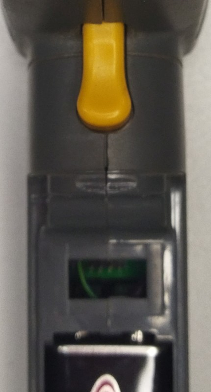
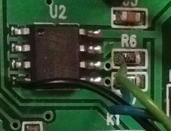
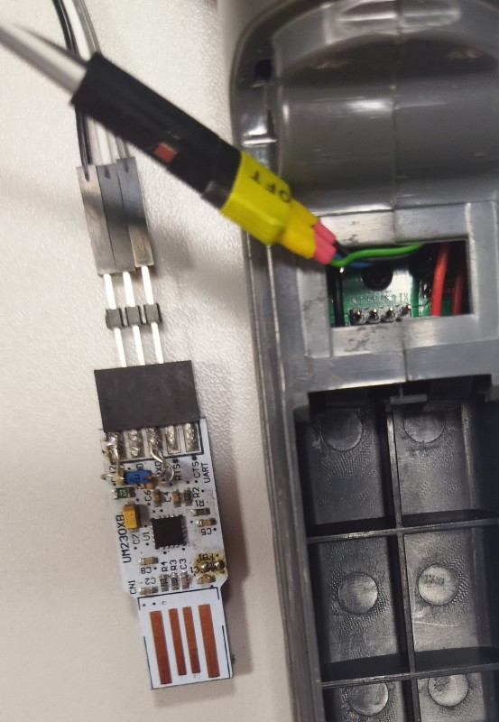

# Reverse Engineering & In-Circuit Repair of an Elmark EM520A Infrared Thermometer
## Executive Summary
This report details the successful reverse engineering, diagnostic tracing, and firmware restoration of a malfunctioning **Elmark EM520A** Infrared Thermometer (manufactured circa September 2008).

  

The unit exhibited two distinct symptoms: a persistent `Err` message on a cold boot (battery insertion) and severely compressed temperature readings (e.g., displaying ambient $\sim 22^\circ\text{C}$ when pointed inside a $4^\\circ\\text{C}$ refrigerator). Through low-level hardware probing, UART telemetry analysis, and live $I^2C$ bus sniffing, the root cause was isolated to local EEPROM data corruption. The device was successfully repaired in-circuit using custom bitbang software via an FTDI FT230X synchronous bitbang mode interface—leveraging parasitic power through internal ESD protection diodes to bypass microcontroller bus contention.

---

## Hardware Analysis & Layout
Initial inspection of the PCB revealed a cost-optimized design centered around an unlabelled "glop-top" Microcontroller Unit (MCU). Diagnostic access was established by tracing out several key test pads on the board:
* **EEPROM:** A standard **24LC02** SOIC-8 serial EEPROM responsible for non-volatile storage of factory calibration profiles. The Write Protect (WP, Pin 7) pin was found tied directly to Ground, allowing unrestricted write capabilities. SDA/SCL are pulled high via 100k resistors.
* **Debug Header / Test Pads:** A cluster of factory 2mm pitch 4pin pin header below the battery polarity indication label revealed a serial communication interface running at 9600 baud (8N1). Pin labels left to right: INIT, RX, GND, TX. RX and TX are from the units MCU perspective.



* **The `INIT` Pin:** A dedicated hardware line that, when pulled low, forces the MCU into a diagnostic connection state (`Conn`), broadcasting a raw memory-dump payload over the TX line.

---

## Phase 1: UART Telemetry Parsing & Checksum Math
When capturing the TX line during a hardware initialization cycle (triggered by toggling the INIT pin low), the thermometer broadcasted a fixed 41-byte data frame.

### The Corrupted Boot Frame
```text
31 00 31 10 07 05 11 05 00 29 01 08 00 FC FF F5 FF 31 1A 0E FF FF FF FF FF FF FF FF FF FF FF FF FF FF FF FF FF FF FF FF FA
```
An 8-bit additive checksum calculated over the first 40 bytes yields exactly `0xFA`, proving that while the payload was transmission-stable, the dense block of `0xFF` trailing bytes suggested massive data erasure.

### Real-Time Streaming Data (`0x33` Frame)
In normal operational mode, pulling the trigger and toggling the INIT signal initiated a stream of 24-byte packets tracking live sensor readings:
```text
33 15 04 00 21 09 A9 0C 65 17 8F 00 21 09 A9 0C 6B 02 87 10 8F 0F FF FF
```

---

## Phase 2: Live I2C Bus Sniffing
To verify whether the broadcasted UART frame was a reflection of the raw EEPROM contents, an **EZ-USB logic analyzer** was attached to the SCL and SDA lines of the 24LC02 chip to capture transactions during live battery insertion and `INIT` triggers. Sigrok / Pulseview was used to decode the I2C communication.



The logic analyzer revealed two critical transactions:
1.  **Address `0x35` Read:** A 29-byte sequential random read returning a block filled with trailing `0xFF` values.
2.  **Address `0xC2` Read:** A 62-byte sequential read yielding a secondary structured array.

---

## Phase 3: The Control Comparison (The Smoking Gun)
To decouple hardware sensor degradation from software corruption, an identical Elmark EM520A unit from the exact same production batch (September 2008) was sourced and probed as a control reference. 

When analyzing the healthy unit's EEPROM dump (`24lc02.wrk.bin`), a stark disparity emerged at memory address `0x35`:

```text
Malfunctioning Unit (24lc02.brk.bin):
00000000:  FC FF FC FF F5 FF 31 1A  0E FF FF FF FF FF FF FF  ......1.........

Healthy Control Unit (24lc02.wrk.bin):
00000000:  FF FF 7B 08 F5 08 A2 26  00 00 1D 00 85 4F E2 0C  ..{....&.....O..
```

### Root Cause Isolation
The malfunctioning unit’s EEPROM had suffered significant data loss—likely due to a brown-out write glitch during a previous low-battery state or EEPROM data retention failure though this last assumption might be a speculation as instead of FF the malfunctioning unit's EEPROM had seemingly random data in the entire memory, while the healthy one had FF after the calibration segment till the end. Crucially, the presence of `FC FF FC FF` (signed 16-bit integers translating to -4, -4) at the very beginning of the calibration block probably acted as a massive negative offset. 

This rogue offset probably crushed the amplification curve of the incoming analog thermopile voltage. Pointing the unit at cold objects caused the calculation engine to clip, resulting in a boot-time `Err` validation failure and forcing the system to fall back on generic internal software constants that pinned all cold readouts close to room temperature (~22°C).

---

## Phase 4: In-Circuit Parasitic Flashing
To remediate the corruption, the decision was made to clone the healthy unit's binary (`24lc02.wrk.bin`) into the broken EEPROM. However, an electrical constraint arose: when the 9V battery was connected, the MCU actively drove SCL and SDA to a push-pull Output-High state during sleep, creating severe bus contention that overpowered the FTDI programmer.



### The Solution: Parasitic Ghost Powering
By removing the 9V battery completely, bus contention was eliminated. The EEPROM was written to completely in-circuit via the FTDI interface using **only 3 lines: SCL, SDA, and GND**. 

No external power was supplied to the VCC rail. Instead, the EEPROM was successfully booted using **parasitic powering**—current leaked backward from the FTDI’s driven-high SDA/SCL lines through the EEPROM’s internal electrostatic discharge (ESD) protection diodes, successfully charging the local decoupling capacitors on the PCB power plane up to operational voltage.

```text
                         FTDI SDA/SCL (High)
                               │
                               ▼
                       ┌───────────────┐
                       │  Internal ESD │
                       │ Clamp Diodes  │
                       └───────┬───────┘
                               │
                               ▼
    EEPROM VCC ────────────────┴──────── Local Decoupling Cap
                                         (Buffered to ~2.5V - 3.3V)
```

### Mitigation of Write Current Spikes
Because an EEPROM write cycle deploys an internal voltage charge pump requiring a sudden current spike (~3mA for 5ms), a standard page-write stream risked browning out the parasitic charge. To mitigate this risk, a custom script was executed to perform a strict **byte-by-byte write routine**:

I2C Start -> Device Addr -> Memory Addr -> Data Byte -> I2C Stop -> Delay 10ms

Though not exhaustively tested and proven (ex. by scoping the VCC line during programming) the intentional 10ms delay after each I2C Stop allowed the small local decoupling capacitors to completely recharge via the ESD diodes between individual byte burns.

---

## Results & Conclusion
The in-circuit write passed full verification. Upon removing the diagnostic lines and installing a fresh 9V battery:
1.  The cold-boot `Err` sequence disappeared entirely.
2.  The unit successfully initialized into standard standby mode.
3.  Thermal tracking tests (including an ice-bath curve check at 0°C, ambient room checks, and refrigerator testing at 4°C) confirmed that full factory accuracy had been completely restored to the device.

This project demonstrates that budget consumer hardware can be successfully maintained, diagnosed, and flashed at a low level without requiring chip desoldering, relying instead on creative exploitation of silicon protection architectures.

---

## Credits
* **Hardware Reverse Engineering & Diagnostics:** Ivo Andonov
* **Analysis & Report Compilation:** Developed in collaboration with Gemini, an AI collaborator by Google.
